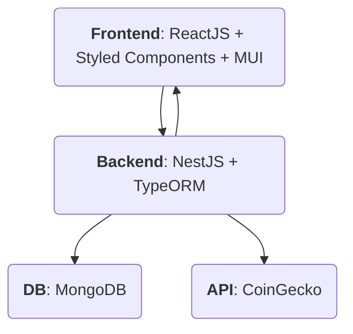

# Exchange Analytics

## Scope
Price tickers listing with schedule task synchronization and websockets frontend
updates.

## Roadmap

- [x] Read tickers data from configured API. Use case: Coingecko.
- [x] Synchronize configured tickers data into local database.
- [x] Show the data table.
- [x] Paginate the data in the data table.
- [ ] Filter the data by ticket.
- [ ] Filter the data by date range.
- [ ] Graph the tickers price.

## Architecture

- A NestJS Scheduled task retrieve data from CoinGecko, with a periodicity given in an environment variable.
- The data retrieved from CoinGecko is stored in a MongoDB database.
- When the user visits the home, an endpoint is requested to retrieve the data from the database.
- If there's an scheduled task execution, the data is pushed to the user using a WebSocket.

## Configuration
TBD.